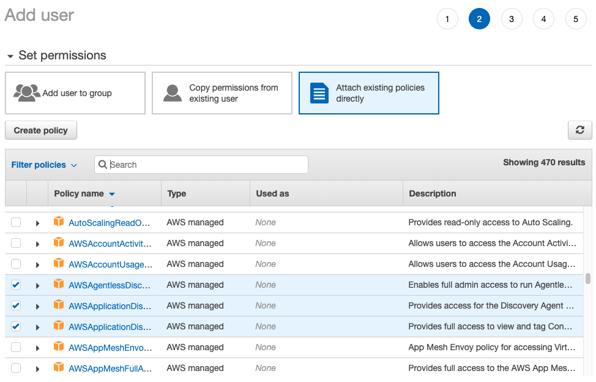

# AWS Application Discovery Service & Migration Hub Lab

---

© 2020 Amazon Web Services, Inc. and its affiliates. All rights reserved. This work may not be reproduced or redistributed, in whole or in part, without prior written permission from Amazon Web Services, Inc. Commercial copying, lending, or selling is prohibited.

Errors or corrections? Email us at onpremsimulator@amazon.com.

# Create your ADS user 

Before proceding installing ADS agents, it is important to create the IAM credentials required to install ADS agents. On this Lab, the ADS IAM user have already been pre-created, so we will proceed only colecting the Access Key and Secret Access Key for the ADS user.

In this exercise, you perform the following tasks:

- Log on AWS Console
- Create the Access Key and Secret Access Key for ADS user

&nbsp;

## Create ADS Credentials

✅ **Step-by-step Instructions**

**1.** Open your [IAM Console](https://console.aws.amazon.com/iam/home?region=us-west-2#/users)

**2.** Click "Add User" and name your new user 

**3.** Attach existing policies directly to your new user.

In the end your user should have these permissions:

💡 If you want to know more about the permissions needed for ADS check [this page](https://docs.aws.amazon.com/application-discovery/latest/userguide/setting-up.html#setting-up-iam).

**4.** Download the .csv file and rename as ADSUser.csv as the information on this file will be used later.

⭐️ **Tip**

🔑 Don't forget to save the IAM credential .csv file as it will be used later

## [Next](./3_enable_athena.md)

✅ Proceed to the next step, [enable Athena integration](./3_enable_athena.md), wherein you'll enable ADS integration with Athena service.

&nbsp;
