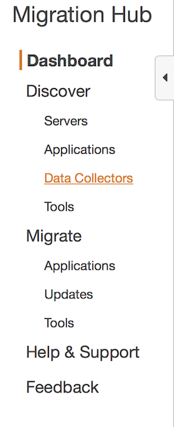
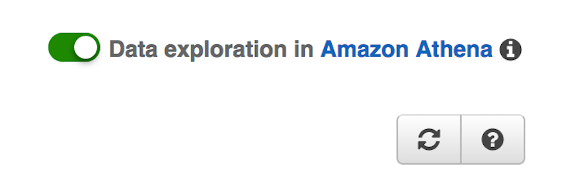

# AWS Application Discovery Service & Migration Hub Lab

---

© 2020 Amazon Web Services, Inc. and its affiliates. All rights reserved. This work may not be reproduced or redistributed, in whole or in part, without prior written permission from Amazon Web Services, Inc. Commercial copying, lending, or selling is prohibited.

Errors or corrections? Email us at onpremsimulator@amazon.com.

# Enable Athena integration with ADS

Before proceding installing ADS agents, it is important to create the IAM credentials required to install ADS agents. On this Lab, the ADS IAM user have already been pre-created, so we will proceed only colecting the Access Key and Secret Access Key for the ADS user.

In this exercise, you perform the following tasks:

- Enable Athena integration with ADS

&nbsp;

## Enable Athena Integration

✅ **Step-by-step Instructions**

**1.** In the AWS Console, open Services, Migration & Transfer, [AWS Migration HUB](https://us-west-2.console.aws.amazon.com/migrationhub/welcome).

If at any time Data Exploration in Amazon Athena is requested to be enabled, please do so.

**2.** In the Migration Hub navigation pane, choose **Data Collectors**.

**3.** Choose the **Agents** tab.

**4.** In the upper right corner, make sure "Data exploration in Amazon Athena" is enabled.

&nbsp;

## [Next](./README_ADS_MD/4_install_ads_agents.md)

✅ Proceed to the next step, [install ADS agents](.././README_ADS_MD/4_install_ads_agents.md), wherein you'll install ADS agents to the linux and windows VMs.

&nbsp;
