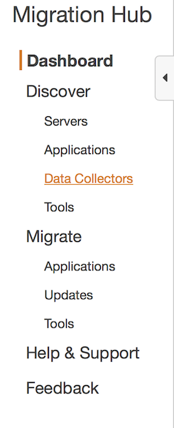

# AWS Application Discovery Service & Migration Hub Lab

---

© 2020 Amazon Web Services, Inc. and its affiliates. All rights reserved. This work may not be reproduced or redistributed, in whole or in part, without prior written permission from Amazon Web Services, Inc. Commercial copying, lending, or selling is prohibited.

Errors or corrections? Email us at onpremsimulator@amazon.com.

# Start Discovery Agent Data Collection

Now that you have deployed and configured the Discovery Agent, you must complete the final step of actually turning on its data collection process.
You start the Discovery Agent data collection process on the **Data Collectors** page of the Migration Hub console.

✅ **Step-by-step Instructions**

**To start data collection**:

**1.** In the AWS Console, open Services, Migration & Transfer, AWS Migration HUB.

If at any time Data Exploration in Amazon Athena is requested to be enabled, please do so.

**2.** In the Migration Hub navigation pane, choose **Data Collectors**.

**3.** Choose the **Agents** tab.

**4.** Select the check box of the agent you want to start.

If you installed multiple agents but only want to start data collection on certain hosts, the **Hostname** column in the agent's row identifies the host the agent is installed on.

**5.** Choose **Start data collection**.

💡 It takes approximately 15 minutes for agents to start collecting data.

**6.** In the upper right corner, make sure "Data exploration in Amazon Athena" is enabled.

---

# Browse Discovery data

The AWS Discovery Connector and AWS Discovery Agent both provide system performance data based on average and peak utilization. You can use the system performance data collected to perform a high-level TCO (Total Cost of Ownership). Discovery Agents collect more detailed data including time series data for system performance information, inbound and outbound network connections, and processes running on the server. You can use this data to understand network dependencies between servers and group the related servers as applications for migration planning.
In this section you'll find instructions on how to view and work with data discovered by Discovery Connectors and Discovery Agents from the console.
You can get a general view and a detailed view of the servers discovered by the data collection tools.  

&nbsp;

✅ **Step-by-step Instructions**

**To view discovered servers**

**1.** In the Migration Hub navigation pane, choose **Discover**, then **Servers**. The discovered servers appear in the servers list.

**2.** For more detail about a server, choose its server link in the **Server info** column. Doing so displays a screen that describes the server details, such as OS, Memory, CPU, Performance Information, etc.

The server's detail screen displays system information and performance metrics.

⭐️ Tips

💡 Explore a few servers to get used to the data collected by ADS.

💡 It takes approximately 15 minutes for agents to start collecting data. If you don't see all the data, wait a few more minutes until ADS starts collecting it.

&nbsp;

## [Next](.././README_ADS_MD/6_data_exploration_athena.md)

✅ Proceed to the next step, [data exploration with Athena](.././README_ADS_MD/6_data_exploration_athena.md), wherein you'll learn how to explore ADS discovered data in Athena.

&nbsp;
