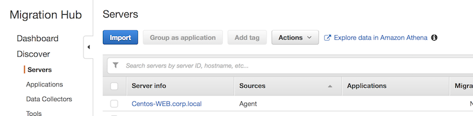
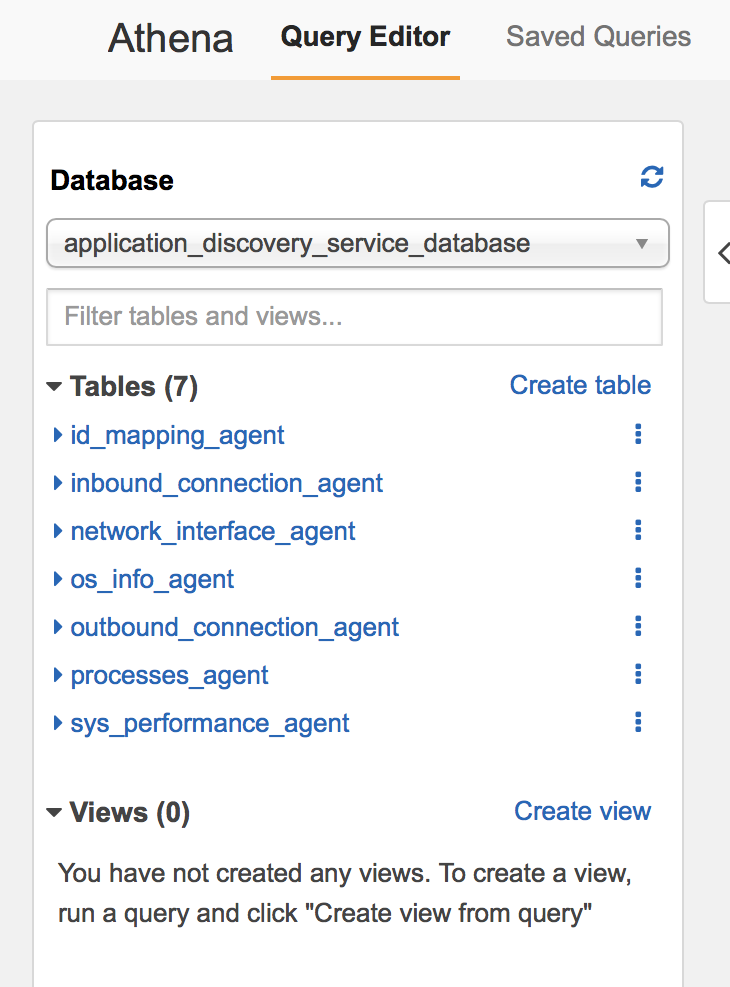
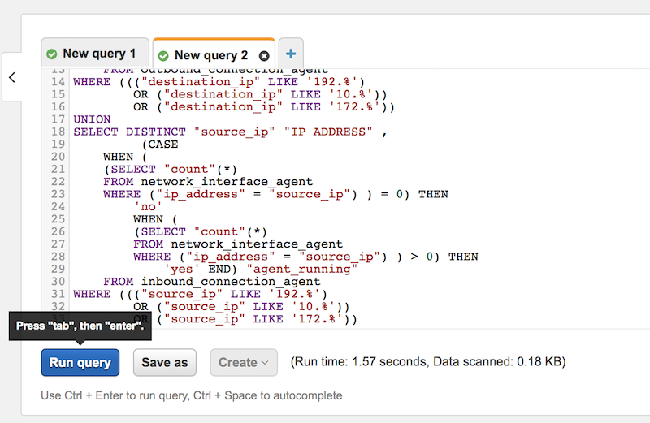
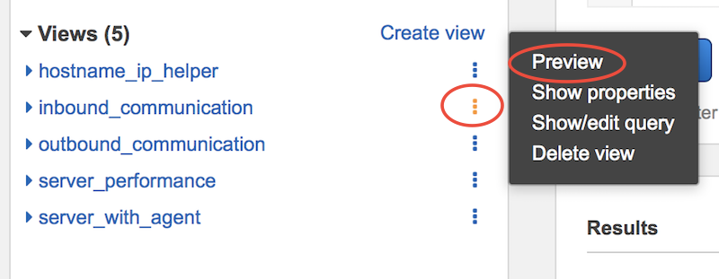

# AWS Application Discovery Service & Migration Hub Lab


---

© 2020 Amazon Web Services, Inc. and its affiliates. All rights reserved. This work may not be reproduced or redistributed, in whole or in part, without prior written permission from Amazon Web Services, Inc. Commercial copying, lending, or selling is prohibited.

Errors or corrections? Email us at onpremsimulator@amazon.com.


# Use Athena to explore data

Once you have enabled Data Exploration in Amazon Athena, you can begin exploring and working with current, detailed data discovered by your agents in Amazon Athena. You can query this data directly in Athena to do such things as generate spreadsheets, run a cost analysis, port the query to a visualization program to diagram network dependencies, and more.

✅ **Step-by-step Instructions**

**To explore agent discovered data directly in Athena**

**1.** In the Migration Hub navigation pane, choose **Servers**.

**2.** Click on the **Explore data in Amazon Athena** link.



**3.** You will be taken to the Amazon Athena console where you will see:

- The Query Editor window
- In the navigation pane:
  - Database listbox which will have the default database pre-listed as application_discovery_service_database
  - Tables list consisting of seven tables representing the data sets grouped by the agents:
    - os_info_agent
    - network_interface_agent
    - sys_performance_agent
    - processes_agent
    - inbound_connection_agent
    - outbound_connection_agent
    - id_mapping_agent



**4.** You are now ready to query the data in the Amazon Athena console by writing and running your own SQL queries in the Athena Query Editor to analyze details about your on-premises servers.

Here you will find a set of predefined queries of typical use cases, such as TCO analysis and network visualization. You can use these queries as-is or modify them to suit your needs. Simply expand the query you want to use and follow these instructions:

**To use a predefined query**

**1.** In the Migration Hub navigation pane, choose **Servers**.

**2.** Choose the **Explore data in Amazon Athena** link to be taken to your data in the Athena console.

**3.** Expand one of the predefined queries listed below (after step 5) and copy it.

**4.** Place your cursor in Athena's Query Editor window and paste the query.

**5.** Choose **Run Query**.



## **Obtain IP Addresses and Hostnames for Servers**

This helper function retrieves IP addresses and hostnames for a given server. This view can be used in other queries.

```SQL
CREATE OR REPLACE VIEW hostname_ip_helper AS
SELECT DISTINCT
  "os"."host_name"
, "nic"."agent_id"
, "nic"."ip_address"
FROM
  os_info_agent os
, network_interface_agent nic
WHERE ("os"."agent_id" = "nic"."agent_id")
```

## **Identify Servers With or Without Agents**

This query can help you perform data validation. If you've deployed agents on a number of servers in your network, you can use this query to understand if there are other servers in your network without agents deployed on them. In this query, we look into the inbound and outbound network traffic, and filter the traffic for private IP addresses, only. That is, IP addresses starting with 192, 10, or 172.

```SQL
CREATE OR REPLACE VIEW server_with_agent AS
SELECT DISTINCT "destination_ip" "IP Address" ,
         (CASE
    WHEN (
    (SELECT "count"(*)
    FROM network_interface_agent
    WHERE ("ip_address" = "destination_ip") ) = 0) THEN
        'no'
        WHEN (
        (SELECT "count"(*)
        FROM network_interface_agent
        WHERE ("ip_address" = "destination_ip") ) > 0) THEN
            'yes' END) "agent_running"
    FROM outbound_connection_agent
WHERE ((("destination_ip" LIKE '192.%')
        OR ("destination_ip" LIKE '10.%'))
        OR ("destination_ip" LIKE '172.%'))
UNION
SELECT DISTINCT "source_ip" "IP ADDRESS" ,
         (CASE
    WHEN (
    (SELECT "count"(*)
    FROM network_interface_agent
    WHERE ("ip_address" = "source_ip") ) = 0) THEN
        'no'
        WHEN (
        (SELECT "count"(*)
        FROM network_interface_agent
        WHERE ("ip_address" = "source_ip") ) > 0) THEN
            'yes' END) "agent_running"
    FROM inbound_connection_agent
WHERE ((("source_ip" LIKE '192.%')
        OR ("source_ip" LIKE '10.%'))
        OR ("source_ip" LIKE '172.%'))
```

## **Analyze System Performance Data for Servers With Agents**

You can use this query to analyze system performance and utilization pattern data for your on-premises servers that have agents installed on them. The query combines the system_performance_agent table with os_info_agent table to identify the hostname for each server. This query returns the time series utilization data (in 15 minute intervals) for all the servers where agents are running.

```SQL
CREATE OR REPLACE VIEW server_performance AS
SELECT "OS"."os_name" "OS Name" ,
         "OS"."os_version" "OS Version" ,
         "OS"."host_name" "Host Name" ,
         "SP"."agent_id" ,
         "SP"."total_num_cores" "Number of Cores" ,
         "SP"."total_num_cpus" "Number of CPU" ,
         "SP"."total_cpu_usage_pct" "CPU Percentage" ,
         "SP"."total_disk_size_in_gb" "Total Storage (GB)" ,
         "SP"."total_disk_free_size_in_gb" "Free Storage (GB)" ,
         ("SP"."total_disk_size_in_gb" - "SP"."total_disk_free_size_in_gb") "Used Storage" ,
         "SP"."total_ram_in_mb" "Total RAM (MB)" ,
         ("SP"."total_ram_in_mb" - "SP"."free_ram_in_mb") "Used RAM (MB)" ,
         "SP"."free_ram_in_mb" "Free RAM (MB)" ,
         "SP"."total_disk_read_ops_per_sec" "Disk Read IOPS" ,
         "SP"."total_disk_bytes_written_per_sec_in_kbps" "Disk Write IOPS" ,
         "SP"."total_network_bytes_read_per_sec_in_kbps" "Network Reads (kbps)" ,
         "SP"."total_network_bytes_written_per_sec_in_kbps" "Network Write (kbps)"
FROM sys_performance_agent "SP" , "OS_INFO_agent" "OS"
WHERE ("SP"."agent_id" = "OS"."agent_id");
```

## **Track Outbound Communication Between Servers Based On Port Number**

This query analyzes the outbound connections from servers discovered using agents. This query helps you to identify the outbound TCP network traffic from the hosts (servers) where agents are installed, along with the frequency at which the outbound traffic is generated. You can visualize the output of this query in Amazon QuickSight Heat Map to understand network dependencies.

```SQL
CREATE OR REPLACE VIEW outbound_communication AS
WITH valid_ips (source_ip) AS
    (SELECT DISTINCT "source_ip"
    FROM outbound_connection_agent ) , outer_query AS
    (SELECT "agent_id" ,
         "source_ip" ,
         "destination_ip" ,
         "destination_port" ,
         "count"(*) "frequency"
    FROM outbound_connection_agent
    WHERE (("ip_version" = 'IPv4')
            AND ("destination_ip" IN
        (SELECT *
        FROM valid_ips )))
        GROUP BY  "agent_id", "source_ip", "destination_ip", "destination_port" )
    SELECT "source_ip" "Source" ,
         "destination_port" "Port" ,
         "destination_ip" "Target" ,
         "Frequency" ,
         "h1"."host_name" "Source Host Name" ,
         "h2"."host_name" "Destination Host Name"
FROM outer_query o , hostname_ip_helper h1 , hostname_ip_helper h2
WHERE (("o"."source_ip" = "h1"."ip_address")
        AND ("o"."destination_ip" = "h2"."ip_address"))
```

## **Track Inbound Communication Between Servers Based On Port Number**

This query analyzes the inbound connections from the servers discovered using agents. This query is similar to the outbound connections query and helps you to understand the hosts (servers) that are communicating with a given server over the TCP/IP protocol. You can visualize the output of this query in Amazon QuickSight Heat Map to understand network dependencies.

```SQL
CREATE OR REPLACE VIEW inbound_communication AS
WITH valid_inbound_ips (source_ip) AS
   (SELECT DISTINCT "source_ip"
   FROM
     inbound_connection_agent
)
, outer_inbound_query AS (
   SELECT
     "agent_id"
   , "source_ip"
   , "destination_ip"
   , "destination_port"
   , "count"(*) "frequency"
   FROM
     inbound_connection_agent
   WHERE (("ip_version" = 'IPv4') AND ("destination_ip" IN (SELECT *
FROM
  valid_inbound_ips
)))
   GROUP BY "agent_id", "source_ip", "destination_ip", "destination_port"
)
SELECT
  "source_ip" "Source"
, "destination_port" "Port"
, "destination_ip" "Target"
, "Frequency"
, "hin1"."host_name" "Source Host Name"
, "hin2"."host_name" "Destination Host Name"
FROM
  outer_inbound_query o
, hostname_ip_helper hin1
, hostname_ip_helper hin2
WHERE (("o"."source_ip" = "hin1"."ip_address") AND ("o"."destination_ip" = "hin2"."ip_address"))
```

⭐️ Tips

💡 Now that all the views have been created, spend some time exploring the data that was collected by ADS agents. Under Views, click on the **...** and select Preview. Data will be presented on the results screen. Repeat the steps for all Views.




&nbsp;

## [Next](.././README_ADS_MD/7_grouping_apps_mgh.md)

✅ Proceed to the next step, [grouping applications on Migration HUB](.././README_ADS_MD/7_grouping_apps_mgh.md), wherein you'll learn how to explore ADS discovered data in Athena.

&nbsp;
